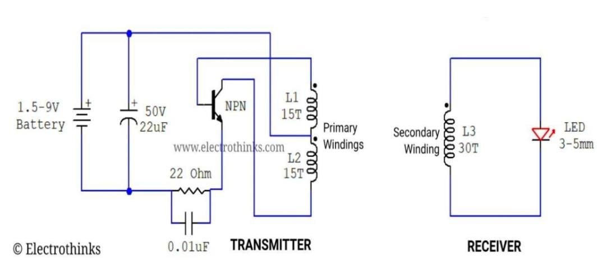
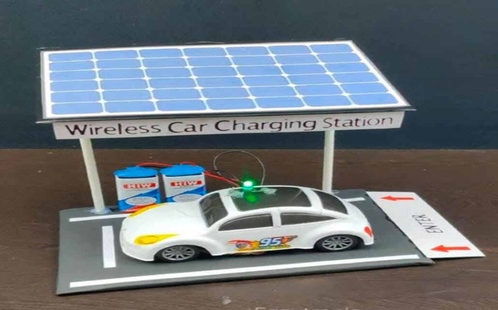
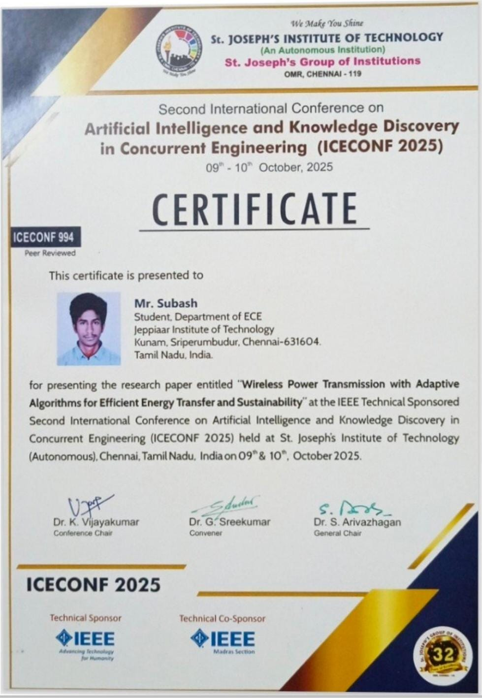
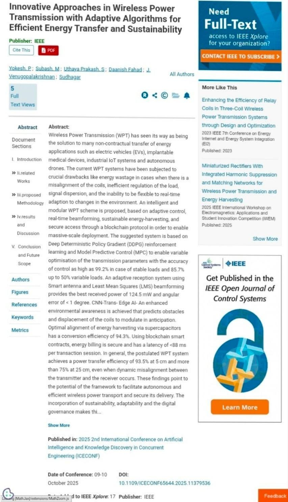

# ⚡ Innovative Approaches in Wireless Power Transmission with Adaptive Algorithms for Efficient Energy Transfer and Sustainability

## 📌 Project Overview

**Innovative Approaches in Wireless Power Transmission with Adaptive Algorithms for Efficient Energy Transfer and Sustainability** is an academic research and prototype project focused on the wireless transfer of electrical energy without direct physical electrical connections.

The project uses a **transmitter coil and receiver coil** to demonstrate wireless power transfer through electromagnetic coupling. The developed prototype was designed to wirelessly power small, low-power electronic components while exploring approaches for improving the efficiency and reliability of energy transfer.

The project combines theoretical research with practical prototype development to understand the principles, challenges, and potential applications of wireless power transmission.

## 🎯 Objective

* To study the fundamental principles of Wireless Power Transmission.
* To understand energy transfer between transmitter and receiver coils.
* To develop a prototype capable of wirelessly powering low-power electronic components.
* To study the factors affecting wireless power transfer performance.
* To explore adaptive approaches for improving energy transfer under varying conditions.
* To understand the potential of wireless power systems for efficient and sustainable energy transfer.

## ⚙️ Working Principle

1. Electrical power is supplied to the **transmitter circuit**.
2. The transmitter circuit drives the **transmitter coil**, generating a changing magnetic field.
3. The generated magnetic field couples with the nearby **receiver coil**.
4. Due to electromagnetic induction, an electrical voltage is induced in the receiver coil.
5. The receiver circuit processes the transferred electrical energy.
6. The received power is supplied to a **small low-power electronic component/load**.
7. The prototype demonstrates electrical energy transfer without a direct conductive connection between the transmitter and receiver.

### 🔄 Energy Transfer

**Electrical Energy → Transmitter Circuit → Transmitter Coil → Electromagnetic Coupling → Receiver Coil → Receiver Circuit → Low-Power Load**

## 📐 Circuit Diagram

The circuit diagram represents the transmitter and receiver sections of the wireless power transmission system and shows the electrical arrangement used for transferring power between the two coils.

## 📈 Results

The developed prototype successfully demonstrated the basic concept of **wireless power transfer between two coils** and the wireless powering of a small low-power electronic component.

The project provided practical understanding of:

* Electromagnetic coupling between transmitter and receiver coils.
* Wireless transfer of electrical energy.
* The effect of coil positioning and separation on power transfer.
* Practical limitations of wireless power transmission.
* Factors influencing the received electrical output.
* The importance of efficient energy transfer for practical wireless power applications.

## 👨‍💻 My Role — Project Lead

As the **Project Lead**, I was involved in understanding and coordinating the project concept, studying the wireless power transmission principle, contributing to the transmitter and receiver prototype development, analysing the circuit and power transfer mechanism, coordinating the project documentation, and preparing the technical presentation and research work.

## 📚 Learning Outcomes

* Understanding the fundamentals of Wireless Power Transmission.
* Learning the principles of electromagnetic induction and magnetic coupling.
* Understanding transmitter and receiver coil operation.
* Exploring factors affecting wireless power transfer efficiency.
* Gaining practical experience in electronic prototype development and testing.
* Understanding the challenges involved in contactless energy transfer.
* Developing technical documentation and research presentation skills.
* Gaining experience in presenting technical research at a conference.

## 🚀 Future Scope

* Improving the efficiency of wireless power transfer.
* Optimizing transmitter and receiver coil design.
* Studying the effect of coil distance and alignment on received power.
* Exploring adaptive control techniques for changing operating conditions.
* Increasing transferable power levels for suitable applications.
* Investigating applications in contactless charging systems.
* Exploring wireless power solutions for low-power electronic and IoT devices.
* Studying sustainable and energy-efficient wireless charging technologies.

## 🔬 Final Prototype

The final prototype demonstrates wireless power transfer using two coils functioning as the **transmitter and receiver**. The receiver coil obtains electrical energy through electromagnetic coupling from the transmitter coil and uses the received power to operate a small low-power electronic component.

## 🏆 Conference Certificate

The research work was presented at the **IEEE-sponsored 2nd International Conference on Artificial Intelligence and Knowledge Discovery in Concurrent Engineering (ICECONF 2025)**, hosted by **St. Joseph's Institute of Technology, Chennai**.

## 📄 IEEE Publication Proof

The research work was formally compiled and published by **IEEE** following the conference presentation.

**DOI:** `10.1109/ICECONF65644.2025.11379536`

## 📥 Full Conference Paper

[📄 View the Full Conference Paper](sem3-conference-paper-subash-m.pdf)
